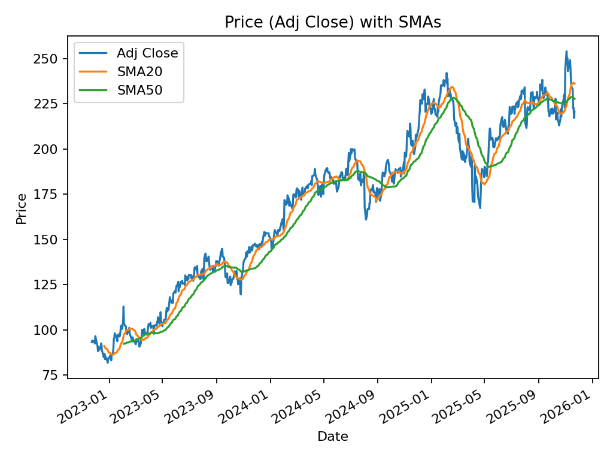
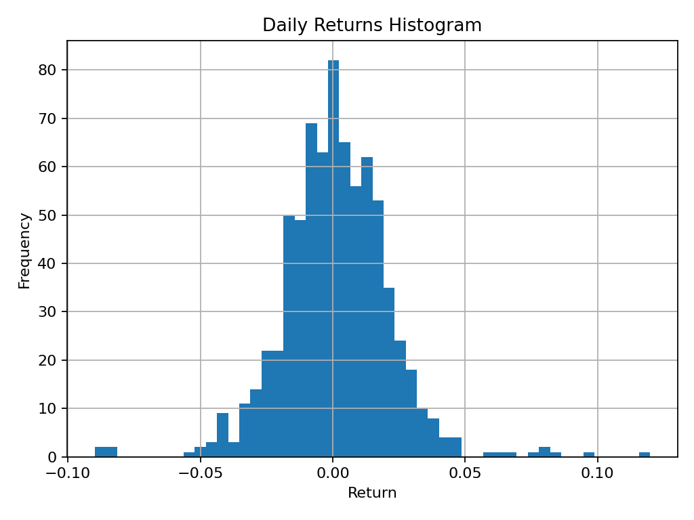
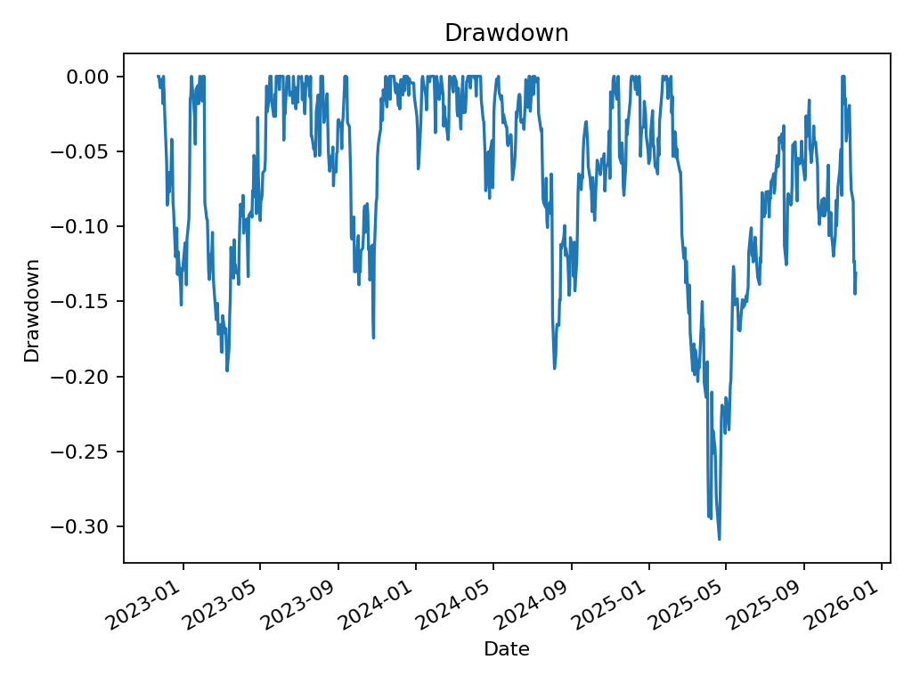

# Stock Price Analyzer — AMZN_2022-02-01_to_2025-02-19

## Performance Summary
- **start**: 2022-02-01
- **end**: 2025-02-18
- **days**: 1113
- **cagr**: 14.2087%
- **total_return**: 49.9072%
- **sharpe**: 0.5421748500590322
- **max_drawdown**: -51.6759%
- **avg_daily_return**: 0.0815%
- **std_daily_return**: 2.3873%

## Files
- `raw_prices.csv` — original OHLCV
- `timeseries_with_indicators.csv` — price + indicators
- `performance_summary.csv` — one-row metrics
- `price.png`, `returns_hist.png`, `drawdown.png` — charts

## Quick Previews

